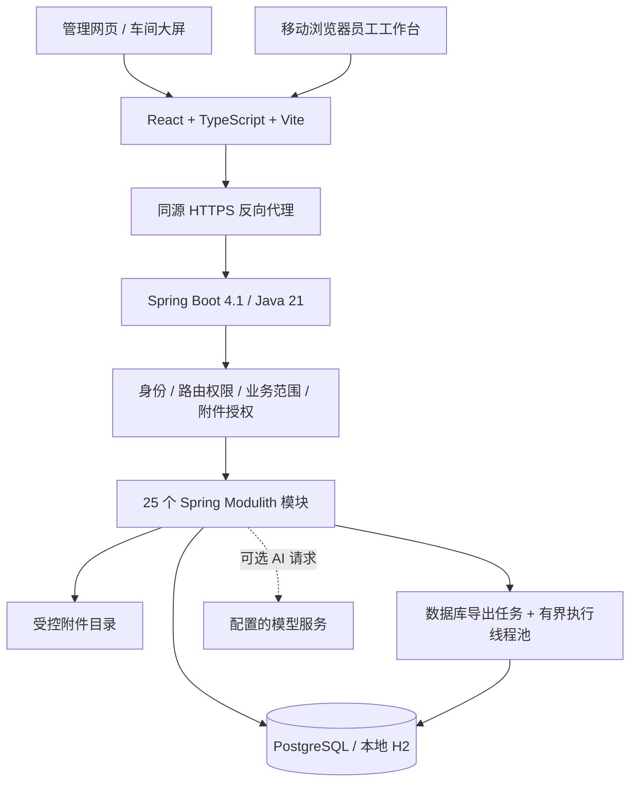
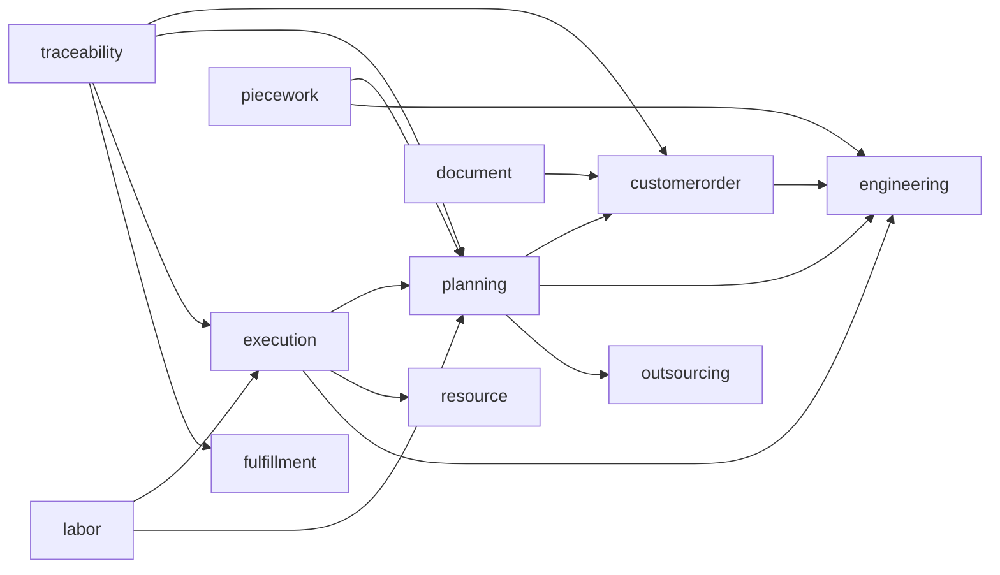
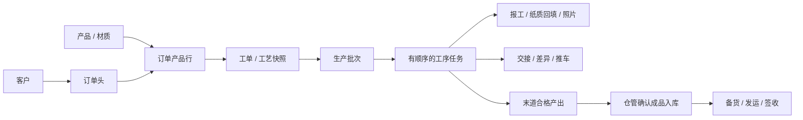

# 系统架构与维护边界

核对日期：2026-10-02。对象为本仓库源码，不包含原免登录测试目录及工厂运行数据。

## 1. 架构结论

当前是 **模块化单体**，不是微服务系统。React 网页与移动工作台共用一个后端和数据库；业务模块通过应用服务、接口端口及共享数据库协作。

继续保持单体部署是本轮的工程选择：订单、模具占用、派工、报工和库存需要较强的一致性，目前没有证据表明拆成独立服务能抵消其带来的分布式事务、部署和排障成本。优先治理模块边界、数据库并发和测试可信度。

Java 包依赖无循环不代表数据库已完全解耦。`common/BusinessAccess`、附件授权、报表及部分业务应用仍直接读取其他模块的表；这属于现有架构约束，不应被包装成已经实现的独立领域服务。

## 2. 运行视图

反向代理和 HTTPS 是实际部署要求，不是 Vite 开发服务器提供的生产能力。当前没有微信原生小程序、独立消息中间件或对象存储；移动端是响应式 Web。

| 层次 | 主要入口 | 职责 |
| --- | --- | --- |
| 页面 | `frontend/src/App.tsx`、`pages/` | 岗位工作台、业务页面、导航及路由 |
| API 客户端 | `frontend/src/api.ts` | 请求、登录会话、CSRF、上传和下载 |
| 查询状态 | `frontend/src/hooks.ts` | 丢弃过期响应，避免快速检索覆盖新结果 |
| 弱网报工 | `frontend/src/offlineQueue.ts` | 按员工隔离待传记录，同一操作号重试 |
| HTTP 边界 | `common/ProductionIdentityBoundary`、`ProductionRoutePolicy` | 校验可信调用者、角色权限与业务对象范围 |
| 业务层 | 各模块 `*Application` | 状态转换、数量校验、事务及审计 |
| 持久化 | JPA Repository、JdbcTemplate、Flyway | 同库事务、锁、查询和版本化迁移 |

前端隐藏按钮不是授权依据。后端必须独立验证所有操作。弱网队列是本机暂存，不是数据库备份，也不能跨账号代传。

## 3. 模块清单

表中为业务责任和代表性数据，不表示数据库已按 schema 物理隔离。

| 模块 | 责任 | 代表性数据或入口 |
| --- | --- | --- |
| `customerorder` | 客户、订单、多产品行、提交、复核、退回 | `customer_order_customer/header/line` |
| `engineering` | 产品、材质、路线、工艺卡模板及版本、SOP | `engineering_product`、RouteCatalog |
| `planning` | 工单、批次、投产、派工、拆分、后处理决策 | `planning_work_order/batch/task` |
| `execution` | 电子报工、交接、制壳、炉次、扫码、操作留痕 | `execution_report`、炉次及交接记录 |
| `resource` | 模具与资产、库位、领还、维修、推车、二维码、产品模具关系 | `resource_asset`、`mold_storage_location`、`asset_qr_label` |
| `inventory` | 库存流水、余额、条件检索及异步导出 | 库存台账、`inventory_export_job` |
| `fulfillment` | 成品入库、成品批次、备货、发运、签收 | `finished_goods_lot`、`delivery_order/event` |
| `outsourcing` | 供应商、外协单、外协进度及砂型生产联动 | `outsourcing_order` |
| `quality` | 检验、合格数量和不合格处置 | `quality_inspection` |
| `labor` | 工时、主管代录、纸质报工及审核入账 | LaborOperationsApplication |
| `piecework` | 产品/工序工价、冻结版本、计件台账、月度明细和工资导出 | `piecework_rate/entry` |
| `document` | 派工单、流转卡、工艺卡、字段选择与输出审计 | DocumentApplication |
| `traceability` | 按订单聚合工单、任务、报工和交付时间线 | TraceabilityApplication |
| `reporting` | 工厂统计、岗位看板 | ReportingApplication |
| `sales` | 销售人员及订单业绩视图 | SalesPerformanceApplication |
| `identity` | 本地账号、密码、角色权限及身份视图 | 登录接口、权限管理 |
| `organization` | 员工、组织与角色分配 | `organization_member` |
| `workflow` | 可配置审批定义、参与者、审批事实 | WorkflowApplication |
| `configuration` | 可配置业务参数 | ConfigurationApplication |
| `notification` | 个人消息与通知状态 | NotificationApplication |
| `assistant` | 工艺草稿、异常解释、风险与 SOP 辅助 | MesAiAssistantApplication |
| `integration` | 集成记录与重试 | IntegrationApplication |
| `operations` | 运维概览 | OperationsApplication |
| `simulation` | 演示生产数据和流程模拟 | MonthlyProductionSimulationApplication |
| `common` | 可信身份、访问边界、附件、异常、分页、协作端口 | BusinessAccess、AttachmentAccess、各 Port |

`simulation` 的 HTTP 接口在 `secure` / `prod` 下禁止访问，不能作为生产初始化或日常修复工具。

## 4. 依赖规则

每个模块的 `package-info.java` 现在都有显式 `allowedDependencies`。`ArchitectureTests` 检查 25 个模块、声明完整性以及 Modulith 依赖规则；新增跨模块依赖必须修改声明并接受审查。`common` 和 `operations` 不允许依赖其他业务模块。

下图展示主要编译依赖，省略公共基础模块和外围模块；箭头不是生产流程顺序。

核心协作端口位于 `common`，实现仍在业务模块内：

| 端口 | 实现 | 作用 |
| --- | --- | --- |
| OrderReleasePort | PlanningApplication | 订单放行生成工单与任务链 |
| ProductionTaskPort | PlanningApplication | 向资源模块提供任务快照及有限操作 |
| MoldTaskPort | MoldApplication | 派工申请模具、出库和核验 |
| OperationalAuditPort | OperationalAuditApplication | 业务操作审计 |
| OutsourcingProductionPort | OutsourcingProductionApplication | 外协节点推进砂型任务链 |

这些端口是同步调用，不是消息队列或异步领域事件。不能因为没有 Java 引用环就认为不同模块可以单独部署。后续若拆分 `common`，应先将基础设施、授权读模型和协作契约分开，再逐项迁移调用者，不能一次移动全部业务查询。

## 5. 生产与数据链

- 一个订单可以有多个产品行；产品、规格、材质和价格属于各自订单行，不能用订单级字段替代。
- 一个工单可以拆出多个批次；批次拥有独立任务链，部分报工先流转时保留来源与数量关系。已执行事实不能靠覆盖任务数量重新解释。
- 中温蜡：射蜡、修蜡、组树、制壳、脱蜡、浇筑、脱壳、分割、半成品清点、可选后处理、成品清点。制壳有人工/自动化模式。
- 低温蜡：相同的 11 个节点，但制壳节点为人工制壳。
- 砂型外协：外协发出、外协进度、来料检验。外协单关联生产任务，收到货不等于完成检验；关闭外协单前检查来料检验结果。
- 后处理有本厂、外送及直接成品分支。没有选择后处理时由决策记录表达跳过，不能伪造实际加工报工。
- 末道完成不自动等于仓库有可发库存。成品入库以末道合格产出为上限；已有检验记录时还受检验合格数量约束。
- 工价与生产报工分开：缺工价不应阻止生产；计件候选冻结适用工价和结算日期，已确认台账保留版本、工资归属、代录和确认人员。低温蜡的产出明细与中温蜡计件工资不能混为一个金额规则。

## 6. 事务、锁与重复请求

默认采用数据库 `READ_COMMITTED` 和应用服务事务。JPA 与 JdbcTemplate 使用同一数据源，由 Spring 事务管理协调。不要把外部 HTTP 调用加入持有库存或资源锁的事务。

| 对象 | 当前一致性手段 | 必须保持的约束 |
| --- | --- | --- |
| 任务报工 | 任务行锁、操作号、业务校验 | 重试不重复产量，不跨员工冒名报工 |
| 资产领用 | 资产行锁、有效占用唯一性 | 同一模具不能同时占给冲突生产任务 |
| 模具库位 | 库位行锁覆盖至事务提交、锁后重查占用 | 手动/自动入库和容量修改共用校验 |
| 二维码 | 资产在前、标签在后的加锁顺序 | 一个资产绑定原标签，补打不换身份 |
| 库存与成品 | 余额/批次锁、入库操作号 | 不超收、不超发、不重复入库 |
| 导出任务 | 数据库领取、租约、执行令牌 | 旧工作者不能覆盖新执行结果 |

本轮库位修复将进程内 `synchronized` 替换为事务内数据库锁，放在 `resource/internal/MoldStorageLocations`，由模具入库与通用资产登记共用。自动分配按库位编码顺序加锁，等待其他事务后再次计算占用。选不到位置时返回明确冲突，不静默挤占。

库位容量是**分配容量**：模具内部使用或外出维修仍保留原位置，避免返库时失去位置。容量大于 1 的位置允许相应数量的模具；默认容量为 1。通用资产登记未填写位置的旧兼容路径仍可创建未分配资产，不能把它当成已经完成库位入库。模具入库入口始终选择或自动分配受管理的位置。

校验仅保护经过这些应用服务的写入，DBA 手写 SQL 或旧版程序仍可能绕过；不能在新旧版本混跑期间宣称库位并发约束有效。升级先停旧实例，历史异常先盘点，不自动搬动实物或重写库位。

二维码展示查询使用外连接读取资产信息，但锁只作用在标签基础表，不再对外连接整体执行 `FOR UPDATE`。这解决了 PostgreSQL 拒绝外连接可空侧加锁的问题。

## 7. 安全边界

1. `secure` 使用管理员开通的真实本地账号会话；`prod` 额外支持受校验的 JWT。默认 profile 是回环演示，不具备生产访问保护。
2. 本地会话绑定有效员工，JWT 通过受控 issuer/subject 绑定。请求中的工号不能替换登录身份；停用或凭据版本变化会影响后续访问。
3. 路由级策略检查角色/权限，业务层再检查产线、工序、分派、仓库和对象归属。通用实体 ID、导出和扫码也需要检查。
4. 附件由元数据、上传者、显式读者和业务关系共同授权；不能把 `uploads` 当公共静态目录。合同、价格与生产作业信息分开披露。
5. 打印/导出使用服务端字段白名单并留痕，不能仅依赖前端取消敏感字段。
6. 密钥只从环境提供；AI 内容发送到外部配置服务前，应由工厂确认数据范围。AI 输出不能替代工艺发布、质量判定或工资规则。

完整鉴权证据见 [登录与业务授权](AUTHORIZATION_2026-10-01.md)。本轮没有把既有鉴权回归当作重新完成的一轮全角色浏览器测试。

## 8. 部署与升级

- 单实例后端 + PostgreSQL + 持久附件目录是目前较简单的部署形态。前端部署构建产物，由同源 HTTPS 代理后端。
- 多实例部署还需要共享会话或可靠会话路由、共享附件存储、后台任务/告警验证及连接池预算。本轮数据库锁修复不等于整个系统已获得完整集群能力。
- Flyway 源迁移不可重写。本轮只追加 V99 查询索引，未自动清洗原业务数据。PostgreSQL 迁移由构建生成并单独验证。
- 升级前完成停写的数据与附件联合备份；恢复到新库、新目录验收，不能直接覆盖运行库。操作步骤见 [运维说明](OPERATIONS.md)。
- 异步导出有 10 分钟租约、定时恢复和最多 3 次领取；上限、超时和失败状态已有约束。备份、幂等和租约分别解决不同问题，不能相互替代。

## 9. 后续优化顺序

| 优先级 | 当前观察 | 建议验收标准 |
| --- | --- | --- |
| 高 | 历史模具可能没有库位，或通过旧接口写入非受管理位置 | 上线盘点清单闭环，未分配、未知库位和超容量均有责任人处理 |
| 高 | `common` 授权层直接依赖多模块表结构 | 对重要授权查询建立契约测试，逐步提取读模型；每次仍跑越权回归 |
| 中 | 追溯按批次查任务、逐任务查报工，存在随任务数增长的查询次数 | 建立多批次数据基线，批量查询并设查询次数/响应时间预算 |
| 中 | 部分查询先加载再做权限过滤，可能扩大内存与重复授权查询 | 在不缩减正确数据范围的前提下改为数据库过滤和分页，验证总数一致 |
| 中 | 前端主包约 802 KB，图表包约 574 KB | 按岗位路由逐步懒加载，验证首次进入、切角色、弱网和打印加载状态 |
| 中 | 业务大类文件同时包含查询、命令和 HTTP 入口 | 修改该业务时按职责拆分，不为拆分而移动所有代码；保留公开服务契约 |
| 中 | 本地文件与数据库不是一个原子存储系统 | 保留失败清理，追加受控孤儿文件审计和保留策略，禁止未核对即批量删除 |

这些项目是待验证的后续工作，不是本轮已经实现的功能。当前修复、测试结果和已知边界见 [本轮审查记录](QUALITY_REVIEW_2026-10-02.md)。
